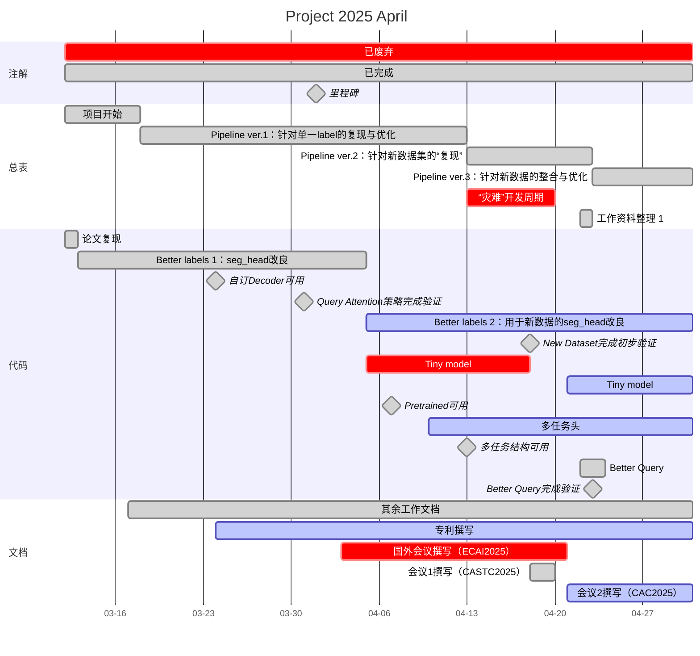

也算是给25年4月这个项目画上一个句号。

## 整体项目开发时间线

> 使用mermaid甘特图绘制。

```mermaid
---
    # Frontmatter config, YAML comments
    config:
        gantt:
            useWidth: 800
            rightPadding: 0
            numberSectionStyles: 2
---

%% depre style
%%{init: { 'themeCSS':
'rect[id^=depre] { fill: DarkSalmon; stroke-width: 0; }'
} }%%

gantt
    dateFormat YYYY-MM-DD
    title Project 2025 April

    axisFormat %m-%d
    tickInterval 1week
    %% weekday wednesday

    todayMarker off

    section 注解
        已废弃: crit, depre, 2025-03-12, 2025-05-01
        已完成: done, d, 2025-03-12, 2025-05-01
        里程碑: milestone, done, m0, 2025-04-01, 

    section 总表
        项目开始: done, start, 2025-03-12, 2025-03-18
        Pipeline ver.1：针对单一label的复现与优化: done, v1, after start, 2025-04-13
        Pipeline ver.2：针对新数据集的“复现”: done, v2, after v1, 2025-04-23
        Pipeline ver.3：针对新数据的整合与优化: done, v3, after v2, 2025-05-01
        “灾难”开发周期: crit, s1, 2025-04-13, 2025-04-20
        工作资料整理 1: done, s2, 2025-04-22, 2025-04-23
    
    section 代码
        论文复现: done, e1, 2025-03-12, 2025-03-13
        
        Better labels 1：seg_head改良: done, e2, after e1, 2025-04-05
        自订Decoder可用: milestone, done, cm21, 2025-03-24,
        Query Attention策略完成验证: milestone, done, cm22, 2025-03-31,

        Better labels 2：用于新数据的seg_head改良: active, e3, after e2, 2025-05-01
        New Dataset完成初步验证: milestone,done, cm31, 2025-04-18,

        Tiny model: crit, depre1, after e2, 2025-04-18
        Tiny model: active, e4, 2025-04-21, 2025-05-01
        Pretrained可用: milestone, done, cm41, 2025-04-07,
        
        多任务头: active, e5, 2025-04-10, 2025-05-01
        多任务结构可用: done, milestone, cm51, 2025-04-13,

        Better Query: done, e6, 2025-04-22, 2025-04-24
        Better Query完成验证: milestone, done, e6, 2025-04-22, 2025-04-24
    
    section 文档
        其余工作文档: done, dm1, 2025-03-17, 2025-05-01
        专利撰写: active, d1, 2025-03-24, 2025-05-01
        国外会议撰写（ECAI2025）: crit, depre2, 2025-04-03, 2025-04-21
        会议1撰写（CASTC2025）: done, d2, 2025-04-18, 2025-04-20
        会议2撰写（CAC2025）: active, d3, after depre2, 2025-05-01
```